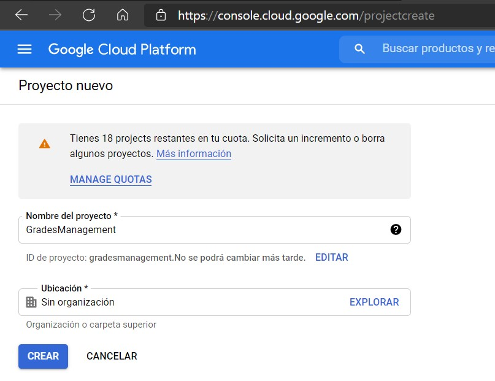
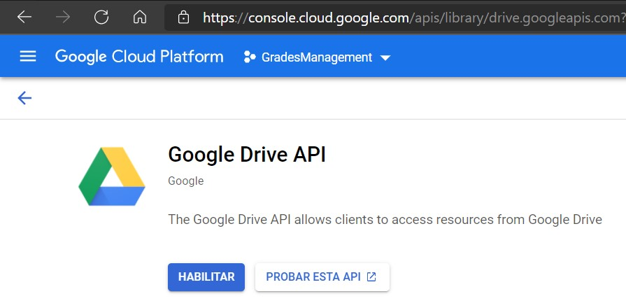
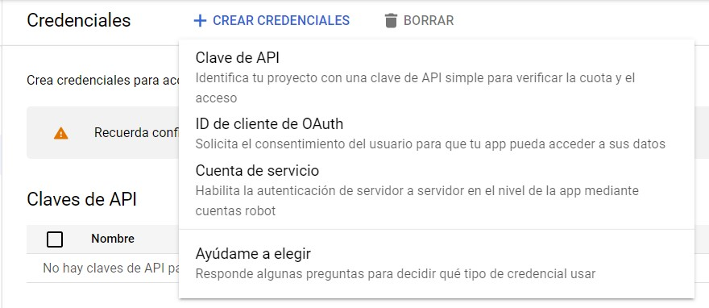
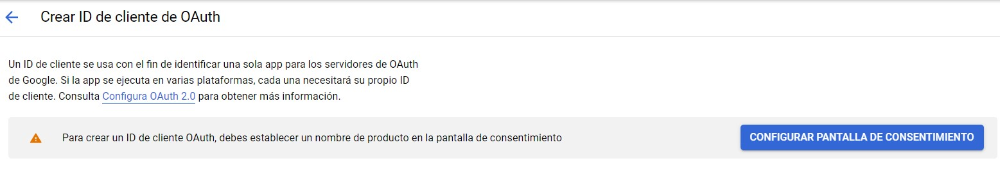
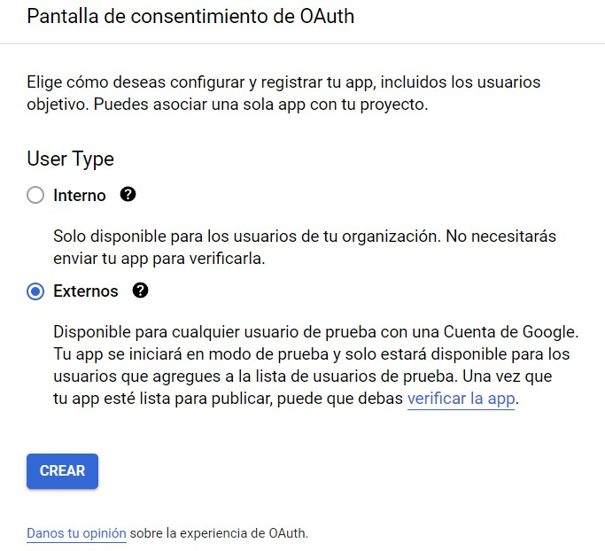
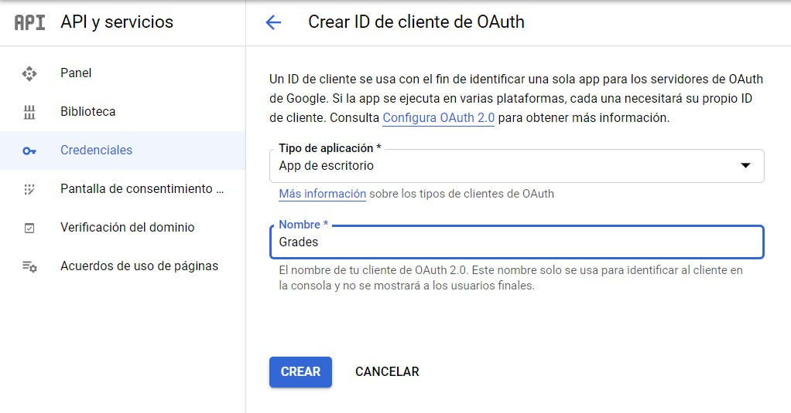
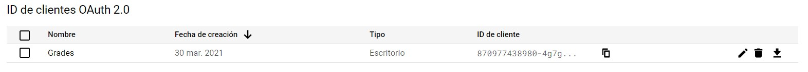

# Grades Management

Programa de consola para extraer las notas de alumnos de un archivo Excel y para envío de correos para optimizar tareas que realizo como auxiliar

## Descargar

#### [Ultima version](https://github.com/alexizzarevalo/GradesManagement/releases/latest) 

- windows-amd64
- darwin-amd64
- linux-amd64

## Indice
1. [Extraer notas de los alumnos](#extraer-notas-de-los-alumnos)
	- [De un Spreadsheet de Google Sheets](#de-un-spreadsheet-de-google-sheets)
	- [De un Excel de Microsoft Office](#de-un-excel-de-microsoft-office)
2. [Generar PDFs de cada hoja del Spreadsheet de Google Sheets](#exportar-a-pdf-cada-hoja-del-spreadsheet-de-google-sheets)
3. [Enviar correo a los alumnos con su PDF](#enviar-correo-a-los-alumnos-con-su-pdf)
4. [Exportar PDFs y enviar correo a los alumnos](#exportar-pdfs-y-enviar-correo-a-los-alumnos)

***

## Token

La aplicacion le solicitará permisos para acceder a Google Drive y Google Sheets.

Al otorgar los permisos, Google le mostrará un código que debe pegar en la consola.

El archivo se guarda automaticamente en `~./.grades_management/token.json`

Si tiene algún problema con el token (porque ya venció o algo parecido) puede borrarlo y se le pedirá permisos de nuevo.

## Extraer notas de los alumnos

### De un Spreadsheet de Google Sheets

La configuración necesaria para esta tarea en el archivo de opciones es:
 
```json
{
	"sheets": {
		"id": "<spreedsheetId>",
		"credentials": "credentials.json",
		"cells": {
			"grade": "D17",
			"carne": "D3"
		}
	}
}
```

Donde:

- id: id de la hoja de calculo de Google Sheet. Se puede obtener de la URL del archivo:
	- `https://docs.google.com/spreadsheets/d/<spreadsheetId>/edit`

- credentials: ruta del archivo de credenciales para conectarse a la API de Google. **Dejar vacio para usar la ruta por defecto del programa** `~/.grades_management/credentials.json`

- cells:

	- **grade** especifica la celda donde se encuentra la nota del alumno
	- **carne** especifica la celda donde se encuentra el carne del alumno

Ejecutar uno de los siguientes comandos:

```bash
# Mostrará las notas en la consola
./grades_management grades options.json

# Mostrará las notas en un archivo csv
./grades_management grades options.json > notas.csv
```

### De un Excel de Microsoft Office

La configuración necesaria para esta tarea en el archivo de opciones es:
 
```json
{
	"excel": {
		"file": "Notas.xlsx",
        "cells": {
            "grade": "D103",
            "carne": "D3"
        }
    },
}
```

Donde:

- file: es la ruta del archivo de Microsoft Excel donde están las notas.

- cells:

	- **grade** especifica la celda donde se encuentra la nota del alumno
	- **carne** especifica la celda donde se encuentra el carne del alumno

Ejecutar uno de los siguientes comandos:

```bash
# Mostrará las notas en la consola
./grades_management grades-excel options.json

# Mostrará las notas en un archivo csv
./grades_management grades-excel options.json > notas.csv
```

## Exportar a PDF cada hoja del Spreadsheet de Google Sheets

Esta funcion separa cada hoja del spreadsheet en un nuevo spreadsheet para luego ser exportado a PDF y descargarlo.

La configuración necesaria para esta tarea en el archivo de opciones es:

```json
{
	"sheets": {
		"id": "<spreadsheetId>",
		"credentials": "credentials.json"
	}
}
```

> **Para exportar** correctamente, cada hoja debe tener como nombre el carne del alumno

Donde:

- id: id de la hoja de calculo de Google Sheet. Se puede obtener de la URL del archivo:
	- `https://docs.google.com/spreadsheets/d/<spreadsheetId>/edit`

- credentials: ruta del archivo de credenciales para conectarse a la API de Google. **Dejar vacio para usar la ruta por defecto del programa** `~/.grades_management/credentials.json`

Ejecutar el siguiente comando:

```bash
./grades_management export options.json
```

## Enviar correo a los alumnos con su PDF

> **Para enviar correo** debe tener un archivo CSV con los datos de los alumnos. **Como minimo el Carnet y Correo**

> Los PDFs deben tener como nombre el carnet del alumno. (Para relacionarlo con el CSV de alumnos)

> **Para enviar correo**, en configuracion de la cuenta de Gmail se debe activar las aplicaciones inseguras o generar una contraseña de aplicacion en dado caso se tenga configurado doble factor de autenticacion

Ejemplo de archivo csv de alumnos

```csv
carnet,correo,nombre,etc
202101523,correo@gmail.com,alumno ejemplo,etc
```

La configuración necesaria para esta tarea en el archivo de opciones es:

```json
{
	"email": {
        "smtp": {
            "host": "smtp.gmail.com",
            "port": "465"
        },
        "credentials": {
            "email": "<email>",
            "password": "<password>"
        },
        "studentsCsv": {
			"path": "Alumnos.csv",
            "carneIndex": 0,
            "emailIndex": 1
        },
        "subject": "Asunto del correo a enviar",
        "body": "<html><body><h1>Titulo en el cuerpo</h1> <p>Mensaje</p></body></html>\r\n"
    }
}
```

Donde:

- credentials:

	- **email** Correo de gmail emisor.
	- **password** Contraseña del correo de gmail emisor (si activo aplicaciones inseguras) o contraseña de aplicacion (si tiene segundo factor de autenticacion)

- studentsCsv:

	- **path** Ruta del archivo csv con los datos de los alumnos
	- **carneIndex** Indice de la columna del csv donde esta el carnet del alumno (Empieza en 0)
	- **emailIndex** Indice de la columna del csv donde esta el correo del alumno (Empieza en 0)

- subject: Asunto del correo

- body: Cuerpo del correo (Puede ser en formato HTML o texto plano)

> La opcion de smtp debe estar en smtp.gmail.com y 465 respectivamente

Ejecutar el siguiente comando:

```bash
# Mostrará en la consola si no se encontró el correo de un alumno
./grades_management email options.json

# Guardar la salida en un archivo de texto
./grades_management email options.json > emailLog.log
```

## Exportar PDFs y enviar correo a los alumnos

Si se desea exportar los PDF y seguidamente enviarlos y no quiere ejecutar el comando `export` y luego `email` puede realizar ambas acciones con el comando `export-email`.

> Debe tener en options.json la configuracion de export y la de email

Ejecutar el siguiente comando:

```bash
./grades_management export-email options.json
```

## Credenciales de Google Cloud Project

Puede generar credenciales de acceso de un proyecto propio de Google Cloud

### Cree un proyecto en GCP

Creelo en la siguiente url: https://console.cloud.google.com/projectcreate



### Habilite las APIs de Google

Habilite la API de Google Sheets: https://console.cloud.google.com/apis/library/sheets.googleapis.com

Habilite la API de Google Drive: https://console.cloud.google.com/apis/library/drive.googleapis.com



### Cree una credencial

En la siguiente URL cree una credencial

https://console.cloud.google.com/apis/credentials

Seleccione ID de cliente de OAuth



Configure una pantalla de concentimiento



Siga todos los pasos solicitados



Cuando ya tiene la pantalla de concentimiento, regrese a crear el ID de cliente de OAuth

Seleccione aplicacion de escritorio y elija un nombre.



Descargue su credencial y usela en el programa.



## Donde colocar la credencial

El programa busca la credencial en la ruta `~/.grades_management/credentials.json` por lo que puede colocar su archivo en esa ubicacion.

Si desea utilizar otra ubicacion es libre de hacerlo, siempre y cuando modifique el archivo de opciones
colocando en la clave `sheets.credentials` la **ruta hacia el archivo de credenciales**.

---

## Install dependencies

	go mod tidy

## Build

	go build

## Install

	go install